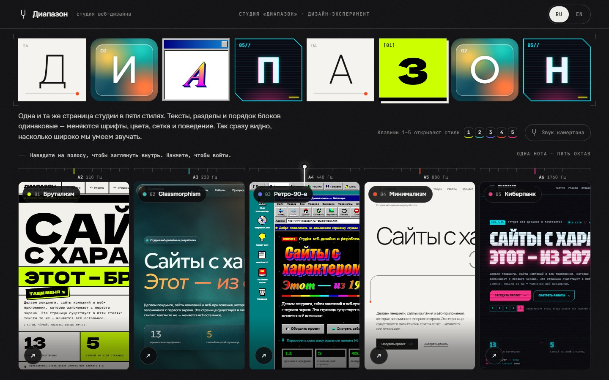
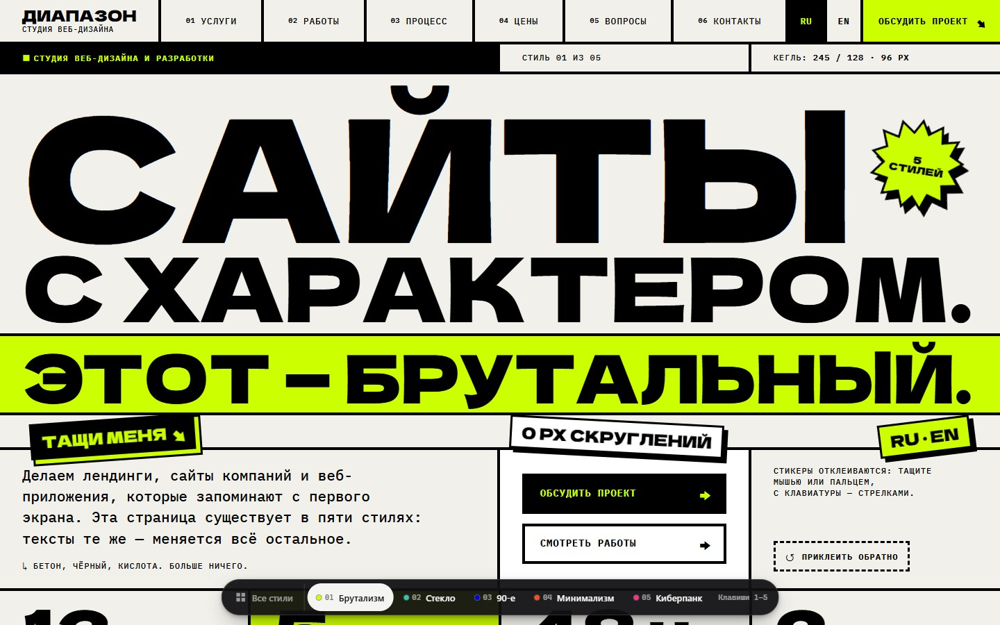
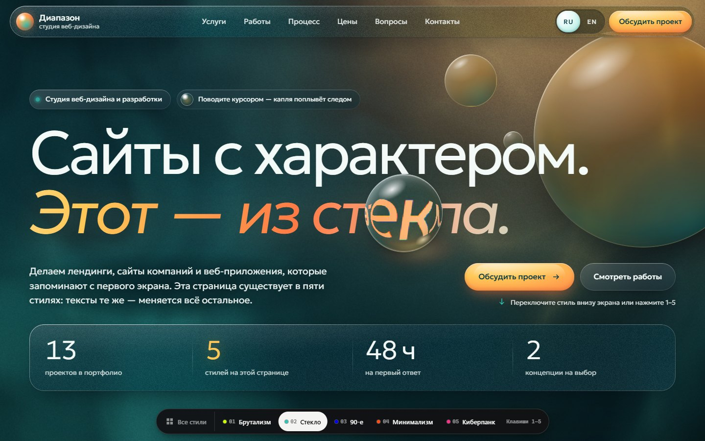
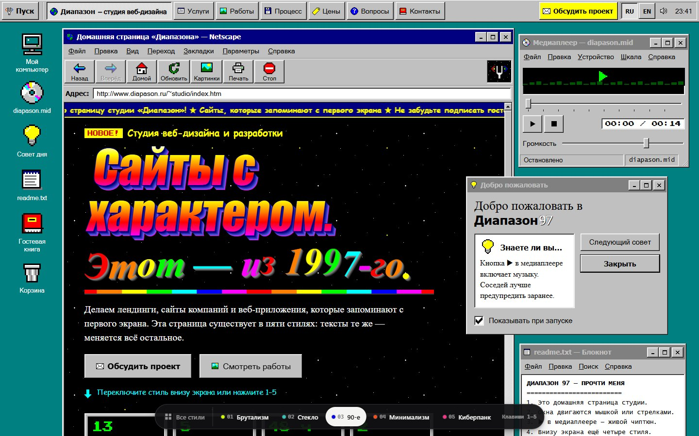
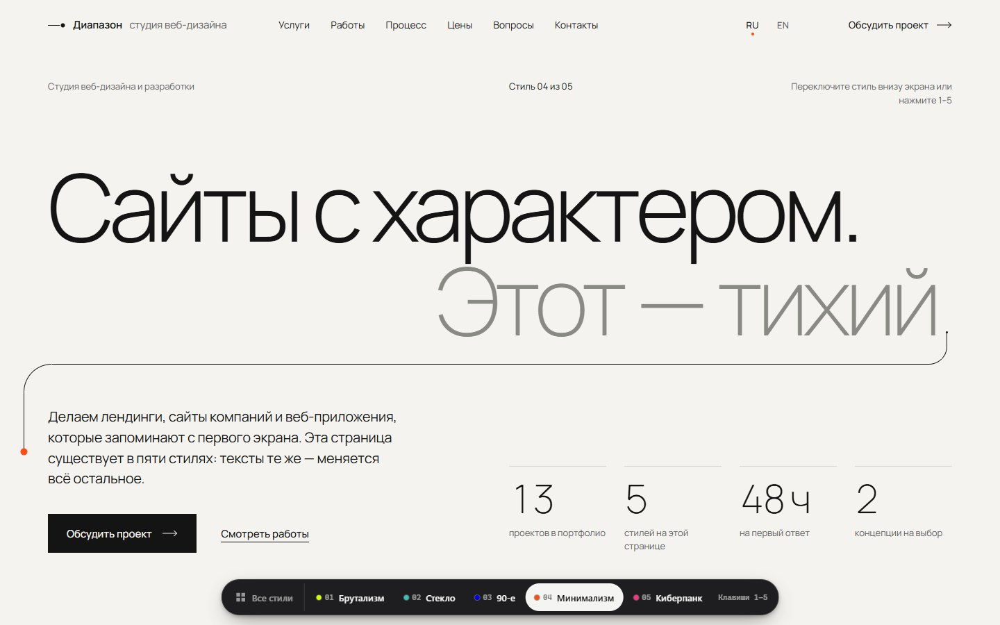
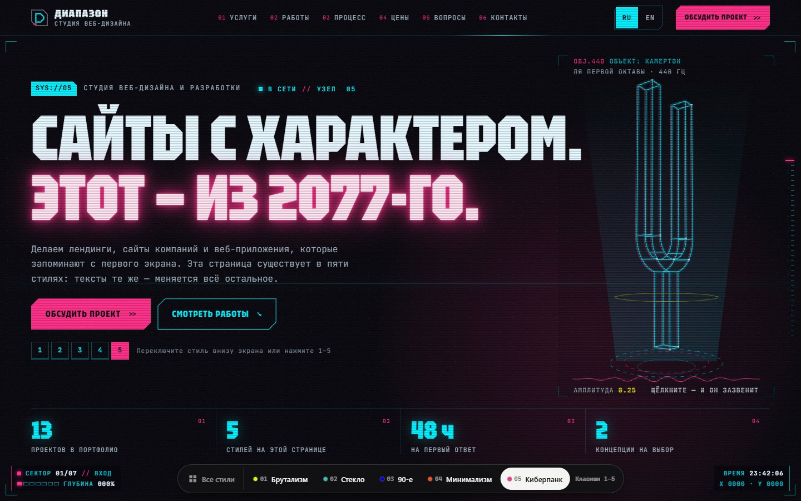
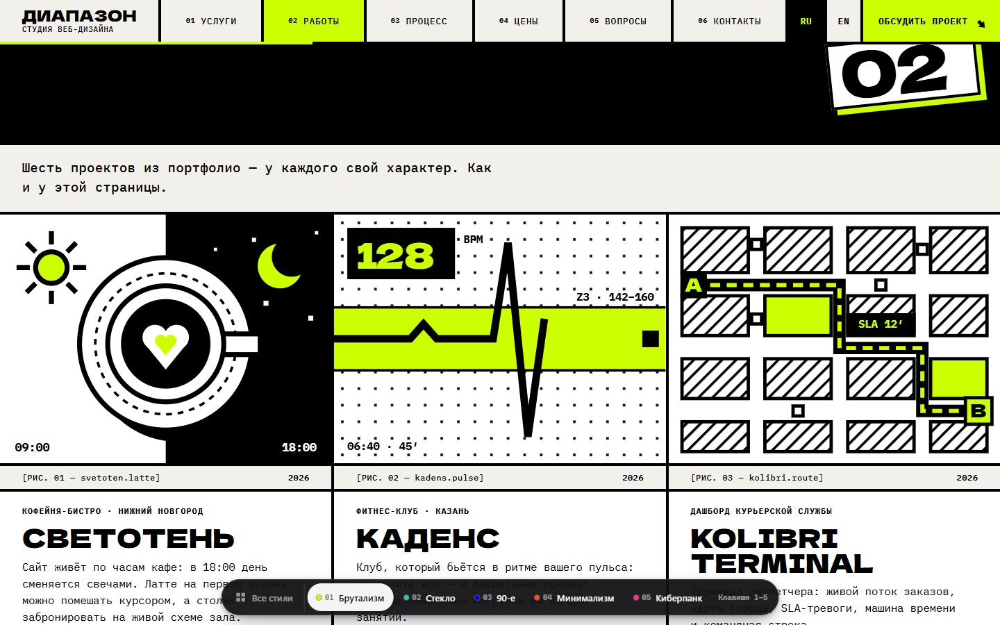
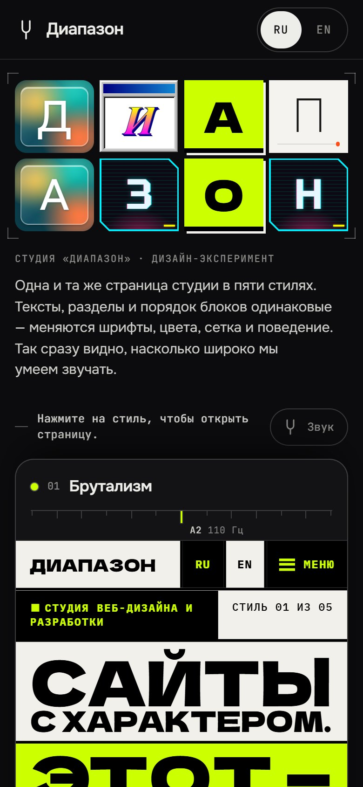
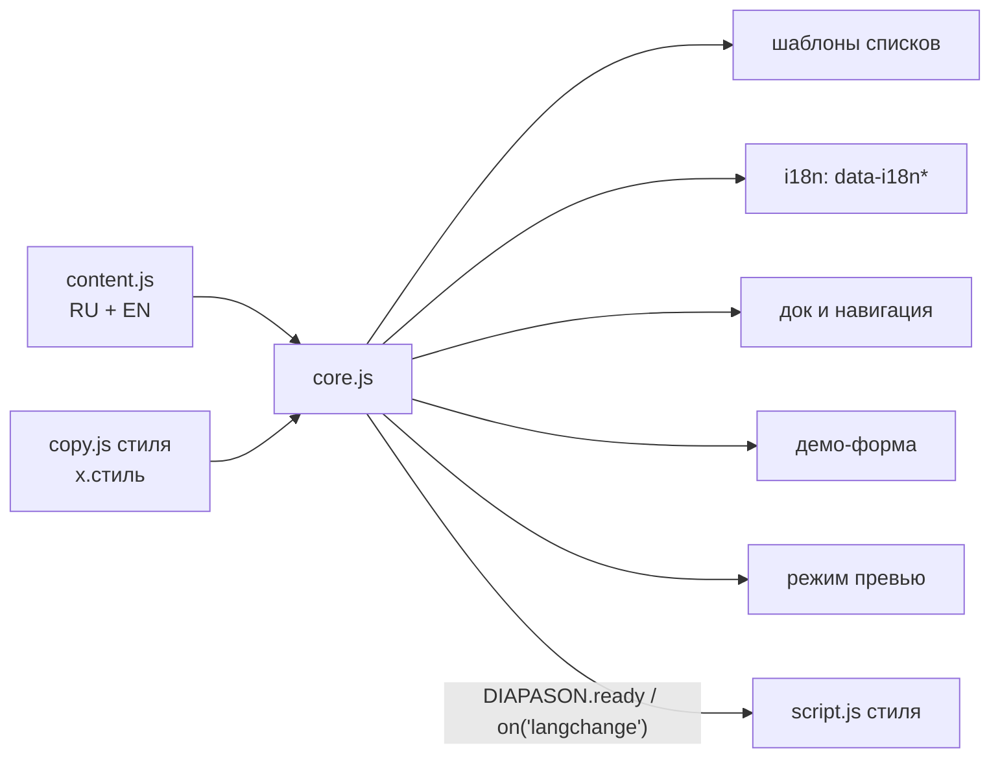

<p align="center">
  
</p>

# Диапазон — один сайт, пять характеров

> Концепт сайта вымышленной студии веб-дизайна «Диапазон»: одностраничный сайт студии существует в пяти стилях — брутализм, glassmorphism, ретро-90-е, минимализм и киберпанк, — а хаб показывает их рядом. Клиент за секунды видит диапазон дизайнера.


**Главное:**

- **Пять полноценных дизайн-систем поверх одного текста.** Тексты, разделы, их порядок и якоря одинаковые на всех страницах. Вёрстка, сетка, шрифты, цвет, анимация и поведение компонентов у каждого стиля свои — это не перекрашенный шаблон.
- **Переключение стиля не теряет место.** Выбрали другой стиль — открывается тот же раздел на том же языке, а новая страница раскрывается кругом из точки клика (cross-document View Transitions).
- **У каждого стиля своя инженерная фишка:** заголовок, подгоняемый под ширину, и перетаскиваемые стикеры; WebGL-каустика и «жидкое стекло» на SVG-смещении; оконный менеджер Windows 95 и чиптюн на Web Audio; одна линия через всю страницу; загрузка системы, HUD за курсором и голографический камертон.

## Идея

«Диапазон» — это полный звуковой объём инструмента, всё, что он может сыграть. Студия с таким названием показывает свой диапазон буквально: одна и та же страница звучит пятью разными голосами. Хаб оформлен как тюнер — пять стилей представлены одной нотой «ля» в пяти октавах, от A2 (110 Гц) до A6 (1760 Гц).

Для клиента это самый быстрый способ понять, что дизайнер умеет работать не в одной манере: достаточно навести курсор на полосы в хабе или нажать клавиши 1–5 на любой странице. Для разработчика — пример архитектуры, где контент и оформление разведены полностью: один файл с текстами на двух языках, общий движок и пять независимых «оболочек», которые не могут разойтись по содержанию.

Каждый стиль доведён до уровня самостоятельного сайта: адаптив от 375 px, оба языка, состояния формы, сниженная анимация, доступность с клавиатуры и своя иллюстрация для каждого из шести кейсов.

## Скриншоты

<table>
  <tr>
    <td width="50%" valign="top"><br><sub>Брутализм</sub></td>
    <td width="50%" valign="top"><br><sub>Glassmorphism</sub></td>
  </tr>
  <tr>
    <td width="50%" valign="top"><br><sub>Ретро-90-е</sub></td>
    <td width="50%" valign="top"><br><sub>Минимализм</sub></td>
  </tr>
  <tr>
    <td width="50%" valign="top"><br><sub>Киберпанк</sub></td>
    <td width="50%" valign="top"><br><sub>Брутализм: работы</sub></td>
  </tr>
</table>

<p align="center">
  
  <br><sub>Хаб на телефоне</sub>
</p>

## Возможности

### Страницы

| № | Страница | Стиль | Фирменный эффект |
|---|---|---|---|
| — | `index.html` | Хаб | Слово «ДИАПАЗОН», где каждая буква набрана в одном из пяти стилей и приземляется с анимацией своего стиля; пять живых превью, разложенных как тюнер (A2–A6, 110–1760 Гц), раскрываются и прокручиваются при наведении; камертон по желанию; таблица сравнения пяти дизайн-систем |
| 01 | `brutalism.html` | Брутализм | Заголовок сам подгоняет строки под ширину и впечатывается жёсткими шагами; кислотные стикеры и ценники можно таскать мышью, пальцем и стрелками |
| 02 | `glassmorphism.html` | Glassmorphism | WebGL-лагуна за настоящим «жидким стеклом» (преломление через SVG-смещение в Chromium); стеклянная капля следует за курсором и изгибает заголовок |
| 03 | `retro-90s.html` | Ретро-90-е | Рабочий стол Windows 95 с домашней страницей в Netscape: перетаскиваемые окна, меню «Пуск», счётчик посещений, гостевая книга и оригинальный чиптюн на WebAudio |
| 04 | `minimalism.html` | Минимализм | Оттенки серого и одна оранжевая точка; единственная линия прорисовывается через всю страницу по мере прокрутки |
| 05 | `cyberpunk.html` | Киберпанк | Загрузка системы, HUD, который следит за курсором, текст, который сам расшифровывается, и голографический камертон, по которому можно ударить |

### Пять дизайн-систем

| Стиль | Шрифты | Палитра | Углы | Движение |
|---|---|---|---|---|
| Брутализм | Dela Gothic One + IBM Plex Mono | `#F2F0EB` `#000000` `#CCFF00` | 0 px | Мгновенные смены, только `steps()` |
| Glassmorphism | Geologica | `#0B3C49` `#2EC4B6` `#FF7A45` `#FFC857` | 28 px | Пружины и инерция |
| Ретро-90-е | Times New Roman, Comic Sans MS, Press Start 2P | `#008080` `#C0C0C0` `#000080` `#0000EE` | 0 px и фаски | Мигание, бегущая строка, блёстки |
| Минимализм | Manrope | `#F4F3EF` `#141414` `#8A8A85` `#FF4D1A` | 0 px, линии 1 px | 600 мс, одна кривая |
| Киберпанк | Tektur + JetBrains Mono | `#08070D` `#00F0FF` `#FF2E88` `#F5F200` | Срезы под 45° | Глитч, сканирование, расшифровка |

### Детали стилей

**01 · Брутализм.** Заголовок раскладывается так, что каждая строка заполняет ширину; длинные слова рвутся по словарю переносов из `copy.js`, оставляя минимум три буквы с каждой стороны. При входе строки проявляются из-под чёрных плашек «цензуры», стикеры «шлёпаются» на место. Четыре стикера в hero и ценники тарифов перетаскиваются в пределах своего раздела, у каждой зоны есть кнопка сброса. Бегущие строки ставятся на паузу кнопкой или наведением. Иллюстрации кейсов — толстые чернила, кислотные заливки и растр. Форма при ошибке трясётся, а успех — кислотная плита с заголовком.

**02 · Glassmorphism.** Фон — WebGL-поле низкого разрешения: глубина, течения лагуны, низкое солнце и водная каустика, свет под курсором догоняет его на пружине. В Chromium стеклянные панели преломляют фон по краям (в остальных браузерах — матовое размытие), по стеклу бегает блик за указателем, карточки наклоняются к курсору до 6°. Список услуг и навигация — перетекающие жидкие капсулы, процесс — стеклянная трубка с каплей, которая едет по ней при прокрутке, FAQ — стеклянные «таблетки», раскрывающиеся на пружине. Зерно поверх градиентов убирает полосы, а при быстрой прокрутке преломление временно уступает место обычному матовому стеклу.

**03 · Ретро-90-е.** Страница «скачивается» через модем 28.8k (любой ввод пропускает загрузку). Оконный менеджер: перетаскивание за заголовок, порядок окон, свернуть, развернуть, закрыть, иконки на рабочем столе и корзина. Панель задач сверху — с часами, меню «Пуск» и подсветкой текущего раздела. Счётчик посещений-одометр, «Совет дня», пиксельные иконки из ASCII-карт, пиксель-арт кейсов в 16-цветной палитре с дизерингом, процесс в виде мастера установки, FAQ как дерево Проводника, форма-гостевая книга, веб-кольцо со ссылками на соседние стили. Проигрыватель «MIDI» играет оригинальную мелодию на 136 BPM и включается только по клику. Блёстки за курсором — только на устройствах с мышью.

**04 · Минимализм.** Одна SVG-линия начинается точкой в конце заголовка hero и заканчивается точкой в конце подписи в футере. Она прорисовывается по мере прокрутки, на её конце — оранжевая точка. На входе точка появляется на месте точки в заголовке, задерживается на 440 мс и начинает рисовать. Интерфейсное движение — 600 мс на одной кривой `cubic-bezier(.22, 1, .36, 1)`: маски для слов, появление строк, «магнитные» ссылки и курсор-точка на устройствах с мышью. Шапка прячется при прокрутке вниз, типограф приклеивает короткие слова к следующим, а числа — к единицам измерения.

**05 · Киберпанк.** Загрузка системы — не дольше двух секунд, один раз за сессию, пропускается кликом или клавишей. HUD с прицелом, который следит за курсором и захватывает цели, часами и индикатором сектора. Заголовки разделов расшифровываются посимвольно при появлении, ссылки и кнопки — при наведении, изредка по заголовкам пробегает хроматический глитч. Голографический камертон нарисован каркасом на Canvas 2D: его можно ударить, а если долго не трогать, он звенит сам. Кейсы — «осколки данных» с неоновыми каркасами, сроки услуг — полосы ETA, контакт — терминал с блочной кареткой.

### Хаб

- **Слово «ДИАПАЗОН».** Каждая из восьми букв набрана в одном из пяти стилей: не больше двух букв на стиль и без одинаковых соседей. Буквы периодически перебрасываются в другие стили, наведение на полосу «настраивает» слово на её стиль, касание буквы мышью перебрасывает её. Для скринридеров слово читается целиком.
- **Пять живых превью.** Каждая полоса — `iframe` страницы стиля в режиме превью; на десктопе он отрисован на виртуальной ширине 1280 px и уменьшен. При наведении или фокусе полоса расширяется и начинает прокручиваться, через 4,2 с после ухода превью возвращается наверх.
- **Тюнер.** У полос — нота и частота, линейка полутонов и стрелка на пружине. Она следует за активной полосой, а при первой отрисовке проходит от нижнего края к A4 — 440 Гц, частоте камертона.
- **Камертон.** Выключен по умолчанию. Включённый, он звучит на частоте выбранного стиля: синусоида плюс короткий металлический обертон ×6,27, как у настоящего камертона.
- **Мобильная колода.** На узких экранах полосы превращаются в липкую колоду карточек, где живая только верхняя. Страницы грузятся по одной, только когда прокрутка затихла на 180 мс и браузер свободен, а закрытые и далёкие карточки не рендерятся.
- **Сравнение дизайн-систем.** Образец «Аа Бб 01» шрифтом каждого стиля, палитры, углы, движение и фишка; на телефоне таблица листается и доступна с клавиатуры.
- **CTA.** Выбор характера для своего проекта: кнопка ведёт в раздел контактов выбранного стиля, камертон звенит на его ноте. Пока посетитель не выбрал сам, хаб подсказывает стиль: на десктопе — тот, что был под курсором, на телефоне — тот, на котором посетитель задержался дольше полутора секунд.

### Общее для всех страниц

- Разделы и якоря: `#top` · `#services` · `#work` · `#process` · `#pricing` · `#faq` · `#contact`, затем футер.
- Док стилей внизу экрана: ссылка на хаб и стили 01–05, текущий подсвечен. На узких экранах подписи сворачиваются до номеров, кроме текущего стиля.
- Переключатель RU/EN; язык запоминается и передаётся между страницами.
- Шесть кейсов: «Светотень», «Каденс», Kolibri Terminal, DVOR 01, «Аэлита», «Ровно». У каждого мотив (`latte`, `pulse`, `route`, `sneaker`, `orbit`, `ring`), и каждый стиль рисует все шесть мотивов своим языком — 30 иллюстраций, все кодом.
- Тарифы: лендинг от 90 000 ₽, сайт компании от 240 000 ₽, веб-приложение от 480 000 ₽.
- Демо-форма заявки с чипами «Что нужно» и «Бюджет», проверкой полей и состояниями «отправляем» и «готово».
- Колофон в футере: название стиля, описание, шрифты и палитра текущей страницы.

## Как это устроено

### Один источник текстов

`assets/core/content.js` хранит каждое слово на русском и английском в `window.DIAPASON_CONTENT`. На страницах нет текста — только ключи:

```html
<!-- minimalism.html, раздел «Избранные работы» -->
<template data-i18n-list="work.items">
  <li class="case" data-motif="{@motif}">
    <p class="case__type" data-i18n="@type"></p>
    <h3 class="case__name" data-i18n="@name"></h3>
    <ul class="case__tags"><template data-i18n-list="@tags"><li data-i18n="@"></li></template></ul>
  </li>
</template>
```

`core.js` синхронно разворачивает шаблоны (`@поле`, `@`, `{i}`, `{n}`, `{nn}`, `{@поле}`, вложенные списки), переписывает ключи в абсолютные пути вроде `work.items.2.name` и заполняет `data-i18n`, `data-i18n-html`, `data-i18n-attr` и `data-i18n-vars`. Поэтому пять версий физически не могут разойтись по содержанию, а переключение языка меняет каждое слово на странице. Стилевые шутки, строки загрузки и подписи лежат в `assets/<стиль>/copy.js` в пространстве `x.<стиль>` и подмешиваются через `DIAPASON_EXTRA`. Ключи `style.*` автоматически указывают на текущий стиль.



Скрипты подключаются в конце `<body>` без `defer`: `content.js` → `copy.js` → `core.js` → `script.js`. Движок инициализируется синхронно, поэтому уже первая отрисовка идёт с текстом. Стилевые скрипты работают через публичный API `window.DIAPASON`: `t()`, `apply()`, `setLang()`, `go()`, `urlFor()`, `ready()`, `on('langchange' | 'previewactive' | 'motionchange')`.

### Переключение стиля с сохранением места

- `currentSection()` берёт последний раздел, верх которого поднялся выше 35% высоты окна. Ссылки дока пересчитываются при прокрутке и ведут на `<стиль>.html?lang=<язык>#<раздел>`.
- При клике по любой ссылке `[data-dz-go]` точка клика сохраняется в `sessionStorage` (при активации с клавиатуры берётся центр ссылки). Встроенный скрипт в `<head>` следующей страницы до первой отрисовки кладёт её в `--dz-vt-x` и `--dz-vt-y`.
- `@view-transition { navigation: auto; }` и `::view-transition-new(root)` раскрывают новую страницу кругом: `clip-path: circle()` растёт от 0 до 150vmax за 760 мс. У дока своё `view-transition-name`, поэтому он не мигает. При `prefers-reduced-motion` переход выключен, в браузерах без поддержки происходит обычная навигация.
- После загрузки шрифтов движок ещё раз выравнивает прокрутку по якорю — если пользователь сам не начал крутить страницу.
- Клавиши `1`–`5` и `0` игнорируются, пока фокус в поле ввода или зажат модификатор.

### Режим превью для хаба

`?preview=1` превращает страницу в тихую миниатюру: у `<html>` появляется `.dz-preview`, дока, загрузчиков, звука, курсоров и следов нет, тяжёлые циклы стоят, пока хаб не активирует полосу. Управление идёт через `postMessage`: `diapason:autoscroll` (прокрутка 0,12 px/мс с паузой 1,2 с внизу и возвратом наверх), `diapason:lang` и `diapason:reset`. Хаб дополнительно проверяет, что во фрейм загрузилась именно нужная страница, и при необходимости повторяет загрузку.

### Технические приёмы по стилям

| Стиль | Как сделано |
|---|---|
| Брутализм | Кегль каждой строки подбирается по её измеренной ширине (с лёгким `scaleX` для точной подгонки), словарный перенос; Pointer Events с захватом указателя, ограничение зоной раздела, стрелки (`Shift` — крупный шаг, `Home` — на место); анимации только на `steps()` |
| Glassmorphism | Фрагментный шейдер WebGL в низком разрешении; карты смещения рисуются на canvas в ¼–½ разрешения, кодируются через `toBlob` в свободное время и кэшируются по квантованному размеру; `feImage` + `feDisplacementMap` в `backdrop-filter: url(#…)` с проверкой поддержки и запасным размытием; хроматический край — несколько смещений разной силы; общий цикл кадров с пружинами |
| Ретро-90-е | Пиксельные иконки из ASCII-карт в SVG; пиксель-арт на canvas с дизерингом; чиптюн на `PeriodicWave` с импульсами скважности 25% и 12,5%, шумом, компрессором и анализатором; счётчик в `localStorage`; блёстки на canvas |
| Минимализм | Один SVG-путь строится по раскладке разделов, `stroke-dashoffset` привязан к прокрутке; путь пересобирается при ресайзе, загрузке шрифтов и смене языка, от 1024 px — отдельная траектория |
| Киберпанк | Каркасный 3D-камертон с проекцией на Canvas 2D; расшифровка текста с сохранением настоящего текста в `aria-label`; срезанные углы через `clip-path`; загрузка один раз за сессию через `sessionStorage` |

### Сервер и форма

`serve.mjs` — статический сервер на `node:http` без зависимостей: таблица MIME-типов, защита от выхода за корень (403), `Cache-Control: no-cache`, порт из аргумента, `PORT` или 5178.

Форма проверяет имя (от двух символов) и контакт: email, ник в Telegram (`@` и 4–32 символа) или телефон (от 10 символов). Затем она показывает состояние отправки (900 мс, 200 мс при сниженной анимации) и экран успеха с именем. Движок генерирует события `diapason:formsending`, `formsent`, `forminvalid` и `formreset`.

## Дизайн

- **Хаб** — нейтральная рамка галереи, а не шестой стиль: графит `#0C0C0E`, панели `#141417`, текст `#EDEDEA`, приглушённый `#8B8B88`, тонкие линии. Акцент каждого стиля используется только для его опознавания; синий цвет ретро-ссылок на графите поднят до `#6B6BFF` ради контраста. Шрифты хаба — Onest и JetBrains Mono, шрифты пяти стилей для заголовка и образцов грузятся с подмножеством `&text=` — только нужные буквы.
- **Шрифты** всех страниц — с Google Fonts и с кириллицей. У ретро-стиля системные шрифты эпохи идут первыми, а для систем без них подключены похожие замены: Tinos, Arimo, Comic Relief, Cousine, Oswald.
- **Иллюстрации:** ни одного внешнего изображения — всё нарисовано на SVG, CSS, canvas или WebGL.
- **Адаптив:** от 375 px; стикеры и капля перетаскиваются пальцем; док сжимается до номеров; на хабе мобильная колода.
- **Доступность:** ссылка «Перейти к содержанию», видимый `:focus-visible`, `aria-pressed` на переключателях языка, `aria-invalid` и сообщения об ошибках в форме, фокус на экране успеха. У перетаскивания есть клавиатурная альтернатива: стикеры и окна двигаются стрелками. Отступ прокрутки снизу не даёт доку перекрыть фокус (WCAG 2.4.11). При `prefers-reduced-motion` каждый стиль отключает автоанимации и эффекты движения, загрузочные заставки пропускаются, а переход между страницами становится мгновенным.
- **Языки:** RU и EN; язык определяется по `?lang=`, сохранённому выбору (`diapason.lang`) или языку браузера (ru, uk, be, kk → русский).

## Управление

| Клавиша | Где | Действие |
|---|---|---|
| `1`–`5` | везде | Открыть стиль на том же разделе и языке |
| `0` | стили | Открыть хаб |
| `Tab` / `Enter` | хаб | Раскрыть полосу и перейти в стиль |
| Стрелки, `Shift` + стрелки, `Home` | брутализм, стикер в фокусе | Сдвинуть стикер, крупный шаг, вернуть на место |
| Стрелки, `Shift` + стрелки | ретро, заголовок окна в фокусе | Передвинуть окно |
| Любая клавиша или клик | киберпанк, ретро | Пропустить загрузку |

## Стек

| Технология | Версия | Для чего |
|---|---|---|
| HTML + CSS | — | Шесть страниц, около 14 000 строк разметки и стилей |
| JavaScript | без библиотек и сборки | Движок и пять стилевых скриптов, около 10 000 строк |
| View Transitions API | cross-document; Chrome 126+, Safari 18.2+ | Круговое раскрытие при смене стиля |
| WebGL | 1.0 | Живой свет и каустика в glassmorphism |
| SVG-фильтры | `feImage`, `feDisplacementMap` | Жидкое стекло |
| Canvas 2D | — | Карты смещения, пиксель-арт, блёстки, камертон |
| Web Audio API | — | Камертон в хабе, чиптюн в ретро |
| postMessage | — | Управление превью в хабе |
| Google Fonts | — | Dela Gothic One, IBM Plex Mono, Geologica, Press Start 2P, Tinos, Arimo, Comic Relief, Cousine, Oswald, Manrope, Tektur, JetBrains Mono, Onest |
| Node.js | 16+ | `serve.mjs` — локальный сервер без зависимостей |

## Структура проекта

```
diapason-studio/
├── index.html              — хаб: слово-тюнер, живые превью, сравнение систем, CTA
├── brutalism.html          — 01 · брутализм
├── glassmorphism.html      — 02 · glassmorphism
├── retro-90s.html          — 03 · ретро-90-е
├── minimalism.html         — 04 · минимализм
├── cyberpunk.html          — 05 · киберпанк
├── assets/
│   ├── core/
│   │   ├── content.js      — все тексты на RU и EN, список стилей
│   │   ├── core.js         — i18n, шаблоны, док, навигация, форма, режим превью
│   │   └── core.css        — док, круговое раскрытие, ссылка пропуска, утилиты
│   ├── hub/                — style.css, script.js, copy.js хаба
│   ├── brutalism/          — style.css, script.js, copy.js (словарь переносов, подписи стикеров)
│   ├── glassmorphism/      — style.css, script.js, copy.js
│   ├── retro-90s/          — style.css, script.js, copy.js (шутки, строки модема, советы дня)
│   ├── minimalism/         — style.css, script.js, copy.js
│   └── cyberpunk/          — style.css, script.js, copy.js (строки загрузки)
├── docs/
│   ├── SPEC.md             — спецификация и арт-дирекшн каждого стиля
│   └── skeleton.html       — каноническая разметка, из которой собрана каждая страница
├── serve.mjs               — статический сервер без зависимостей
└── start.bat               — запуск сервера и браузера на Windows
```

## Запуск

```bash
node serve.mjs
```

Откройте http://localhost:5178. Порт можно передать аргументом (`node serve.mjs 8080`) или через переменную `PORT`. На Windows достаточно дважды кликнуть `start.bat` — он запустит сервер и откроет браузер. `npm install` не нужен.

Файлы можно открыть и напрямую с диска, но круговое раскрытие между стилями и живые превью в хабе требуют настоящего origin.

### Как подключить форму

Форма демонстрационная: она проверяет поля и показывает успех, но никуда ничего не отправляет. Чтобы заявки доходили, отправьте данные в Telegram-бота или сервис форм в обработчике `diapason:formsent`, например:

```js
DIAPASON.on('formsent', function (detail) {
  fetch('https://example.com/lead', { method: 'POST', body: JSON.stringify(detail.data) });
});
```

---

Концепт для портфолио. Студия «Диапазон», её цены и контакты вымышлены.
